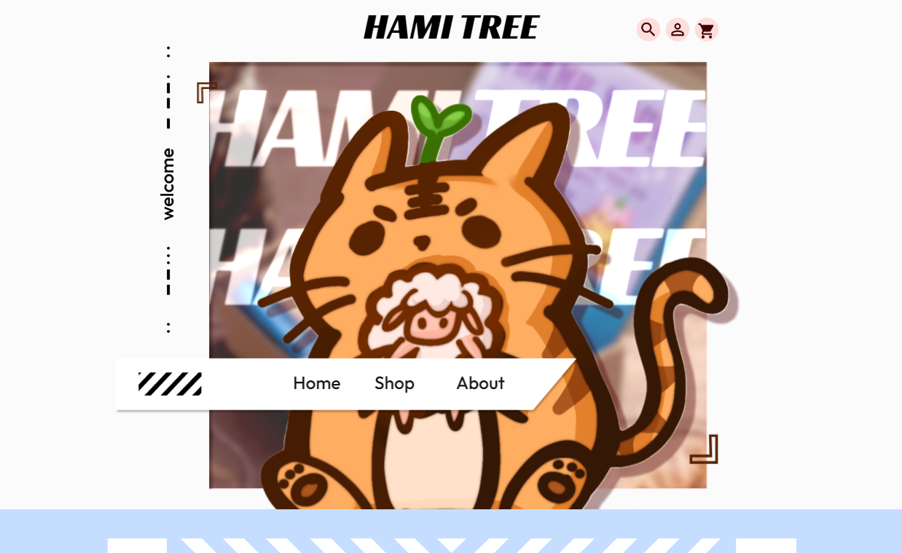

# Hami Tree eCommerce Website

Welcome to the Hami Tree eCommerce Website! This platform serves as the digital storefront for our small art business, Hami Tree. For more information visit our [linktree](https://hamitree.carrd.co/).

## Table of Contents
- [Overview](#overview)
- [Built With](#built-with)
- [Getting Started](#getting-started)
- [Project Structure](#project-structure)
- [Features](#features)
- [Contributing](#contributing)

## Overview
Our Small Business Ecommerce Website is a web application developed to showcase and sell our products online. It incorporates HTML, CSS, JavaScript, and Python to create an interactive and dynamic shopping experience.


Mockup: [Figma Mockup](https://www.figma.com/file/fkk0nwg2vMDLuynsFqmKYW/Ecommerce?type=design&node-id=0-1&mode=design&t=oMlISIhHn1Gv2nVi-0)


<p align="right">(<a href="#readme-top">back to top</a>)</p>

### Built With

- **HTML:** Used for creating the structure and content of the web pages.
- **CSS:** Employed for styling and layout, enhancing the visual appeal of the website.
- **JavaScript:** Implemented to add interactivity and dynamic behavior to the user interface.
- **Python:** Utilized for a machine learning model.


<p align="right">(<a href="#readme-top">back to top</a>)</p>


## Getting Started

1. Clone the repository:
   ```bash
   git clone https://github.com/gy180/eCommerce.git
   cd ecommerce-website
   ```
2. Download the [data](https://www.kaggle.com/datasets/mlg-ulb/creditcardfraud/data ) for the ML code needed at 
   The folder must be named "data" instead of "archive"

3. Open http://localhost:3000/ and verify


<p align="right">(<a href="#readme-top">back to top</a>)</p>

## Project Structure

- `fraud_detection/`: Includes a neural network/machine learning models
- `misc/`: Contanis other items
- `website/`: Contains all the content needed to make the website
   - `website/cart`: Houses the page for the cart
   - `website/home`: Houses the html, css, etc for the home page
   - `website/images`: all the shared images/main images within the pages
   - `website/other_pages`: contains other pages that aren't the main ones
   - `website/shop`: contains the items that are sold (functions like a shop)

<p align="right">(<a href="#readme-top">back to top</a>)</p>

## Features

- User-friendly interface for browsing and purchasing products
- Shopping cart functionality for easy order management

## Contributing

We welcome contributions! If you would like to contribute let us know or fork the repo

## Contact Us

You contact us via social media (found in the link tree)

<p align="right">(<a href="#readme-top">back to top</a>)</p>
